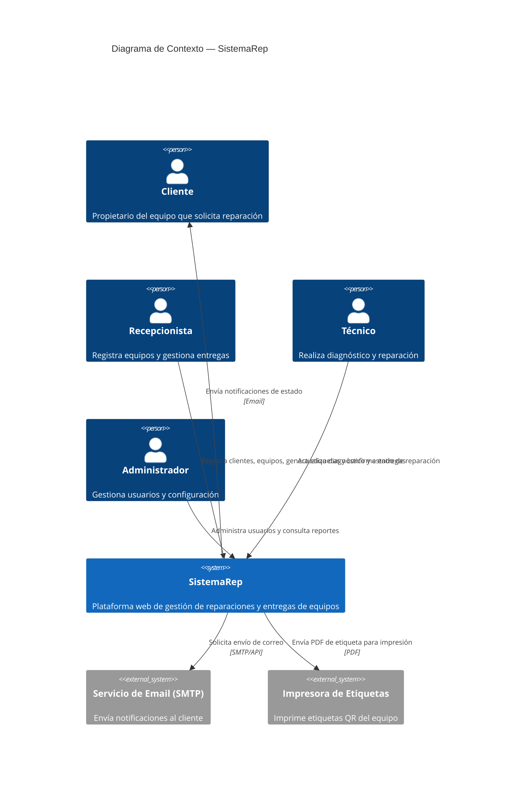
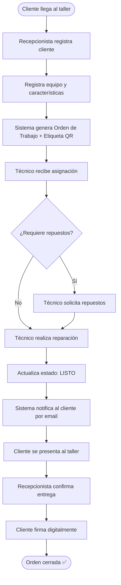

# System Brief — SistemaRep

## 1. Visión del Sistema

**SistemaRep** es una plataforma web para talleres técnicos que digitaliza el proceso completo de recepción, diagnóstico, reparación, etiquetado y entrega de equipos electrónicos. La plataforma busca reemplazar registros manuales en papel o hojas de cálculo, aportando trazabilidad, rapidez y profesionalismo al servicio técnico.

**Visión:** _"Que cada equipo ingresado al taller tenga un ciclo de vida digital completo, auditable y comunicado al cliente en tiempo real."_

---

## 2. Problema que Resuelve

Los talleres técnicos pequeños y medianos operan con procesos informales:
- Órdenes de trabajo en papel o cuadernos
- Sin trazabilidad del historial de reparaciones
- Etiquetas escritas a mano, propensas a errores
- Clientes sin visibilidad del estado de su equipo
- Entregas sin respaldo formal

**SistemaRep** centraliza todo esto en una sola herramienta accesible desde el navegador.

---

## 3. Alcance del MVP

### ✅ Incluido en MVP

| Módulo | Descripción |
|--------|-------------|
| Registro de clientes | Crear y consultar ficha del cliente |
| Recepción de equipos | Registrar equipo con marca, modelo, serie, características y falla reportada |
| Gestión de órdenes de trabajo | Crear, asignar y actualizar estado de reparaciones |
| Etiquetado | Generar etiqueta imprimible con QR y datos del equipo |
| Registro de entrega | Marcar equipo como entregado con fecha y firma digital |
| Notificación básica | Email al cliente cuando su equipo está listo |
| Panel de técnico | Vista de órdenes asignadas al técnico activo |

### ❌ Excluido del MVP (futuras versiones)

- Integración con proveedores de repuestos
- App móvil nativa
- Módulo de inventario de repuestos
- Facturación electrónica
- Reportes estadísticos avanzados
- Multitienda / múltiples sucursales

---

## 4. Actores del Sistema

| Actor | Rol |
|-------|-----|
| **Recepcionista** | Registra equipos, crea órdenes, genera etiquetas y gestiona entregas |
| **Técnico** | Actualiza diagnóstico y estado de reparación |
| **Administrador** | Gestiona usuarios, consulta reportes y configura el sistema |
| **Cliente** | Recibe notificaciones y firma la entrega (no accede al sistema directamente) |

---

## 5. Diagrama de Contexto del Sistema

---

## 6. Flujo Principal del Sistema

---

## 7. Restricciones Técnicas

- La solución debe funcionar en navegadores modernos (Chrome, Firefox, Edge)
- Debe ser responsiva para tablets usadas en el mostrador
- El tiempo de carga inicial no debe superar 3 segundos en conexión estándar
- Los datos deben persistirse en una base de datos relacional
- Las etiquetas deben generarse en formato PDF estándar A6

---

## 8. Métricas de Éxito del MVP

| Métrica | Meta |
|---------|------|
| Tiempo de registro de un equipo | < 3 minutos |
| Generación de etiqueta desde sistema | < 10 segundos |
| Tasa de órdenes con entrega registrada | > 90% |
| Satisfacción del técnico con la herramienta | ≥ 4/5 en piloto |

---

*Documento versionado — v1.0 — Febrero 2026*
